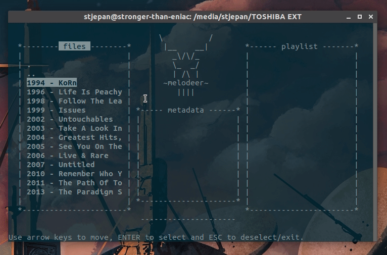

# MelodeerGUI

Linux terminal GUI for Melodeer API. In order to build and/or run, 
[Melodeer](https://github.com/StjepanPoljak/Melodeer) shared library is required. Just follow the instructions on the link.

## Build

To build (after installing Melodeer library), just run `make`. Then, simply run `./melodeergui`.

## Usage

Use arrow keys to navigate, return key to select and escape key to exit (either currently selected window or program). Also:

| key |     action      |
|-----|-----------------|
| `s` |      stop       |
| `p` |      pause      |
| `a` |  append single  |
| `A` | append multiple |
| `d` |     delete      |

## Demo

